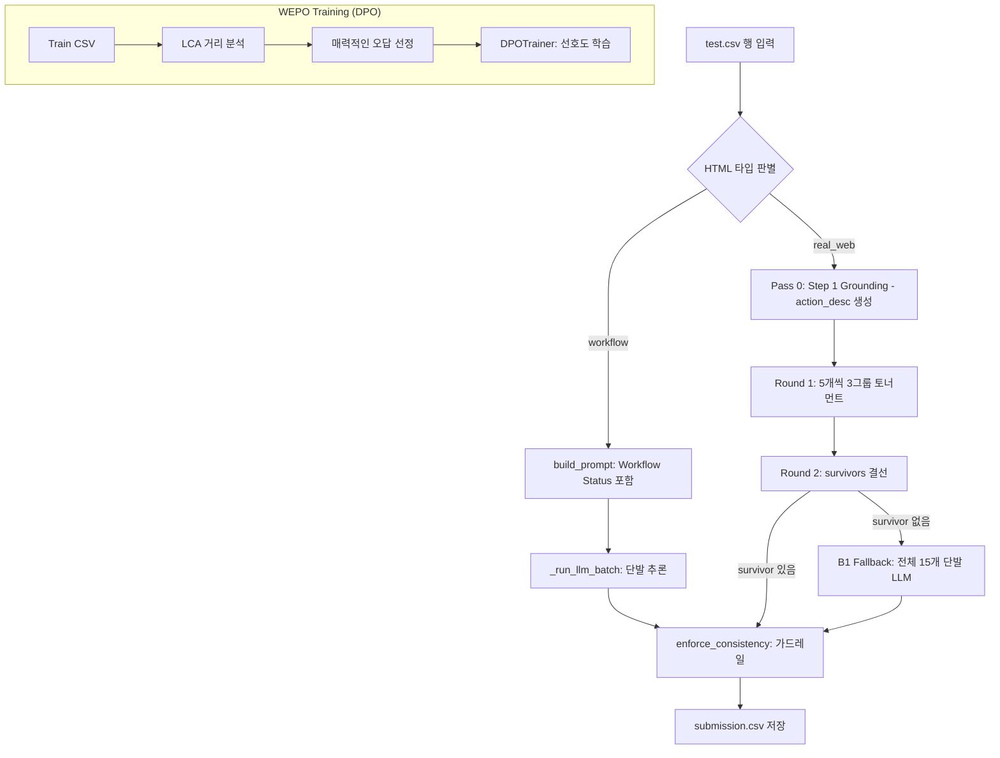

# 파이프라인 종합 설명서 (Unified Pipeline Documentation)
> 최종 업데이트: 2026-05-12
> 기준 코드: `src/preprocess.py` · `src/retrieval.py` · `src/train.py` · `src/inference.py`

본 문서는 프로젝트의 전체 아키텍처, 단계별 상세 로직, 그리고 WEPO 프레임워크 기반의 최신 설계 결정을 통합하여 관리합니다.

---

## 1. 개요 (High-Level Overview)

본 프로젝트는 웹 브라우저 환경에서 사용자의 자연어 지시(Task)와 과거 이력(History)을 바탕으로 최적의 행동(Action)을 예측하는 에이전트를 개발하는 것을 목표로 합니다.

| 입력 데이터 | 설명 | 예시 |
|:---|:---|:---|
| `task` | 수행해야 할 작업 | "Search for flights to Tokyo" |
| `history` | 이전 단계 수행 기록 | "Step 1: [input] 출발지 -> TYPE: Seoul" |
| `cleaned_html` | 현재 화면의 HTML 소스 | `
...` |
| `candidates` | 클릭/입력 가능한 후보 15개 | `[{tag:"button", text:"Search"}, ...]` |

**최종 출력:** `(op, target_id, value)`
- `op`: CLICK, TYPE, SELECT 중 하나
- `target_id`: 15개 후보 중 선택된 요소의 ID
- `value`: TYPE/SELECT 시 입력/선택할 값

---

## 2. 전체 흐름도 (Architecture Flow)

현재 시스템은 HTML 타입에 따라 **Workflow**와 **Real Web** 두 가지 경로로 나뉘며, 학습 단계에서 **DPO(Direct Preference Optimization)**를 통해 선호도를 학습합니다.

---

## 3. 핵심 모듈별 상세 설명

### 3.1. 전처리 및 구조 분석 (`src/preprocess.py`)
LLM 추론 전후의 데이터 정제 및 DOM 트리 기반의 구조적 분석을 담당합니다.

*   **LCA 거리 분석 (`get_dom_distance`)**: 두 HTML 요소 간의 거리를 DOM 트리 깊이를 기준으로 계산합니다 ($depth(u) + depth(v) - 2 \cdot depth(LCA)$).
*   **매력적인 오답 선정 (`find_lca_hard_negative`)**: **WEPO 프레임워크**의 핵심 로직으로, 15개 후보 중 정답과 가장 인접한 요소를 오답(`Rejected`)으로 선정하여 모델의 변별력을 키웁니다.
*   **HTML 컨텍스트 추출 (`get_html_context`)**: 요소 주변의 `label`, `parent`, `children`, `near`(이웃 형제) 텍스트를 추출하여 Dual-View 관점의 정보를 제공합니다.
*   **후보 포맷팅 (`format_numbered_candidates`)**: 1~15번 번호를 부여하고, AgentOccam 기반의 속성 필터링(class, style 제거 등)을 적용합니다.

### 3.2. 검색기 (`src/retrieval.py`)
훈련 데이터에서 유사한 성공 사례를 찾아 Few-shot 예시로 제공합니다 (현재 `USE_RETRIEVAL = False`).

### 3.3. 학습 엔진 (`src/train.py`)
기존 SFT 방식을 넘어 WEPO 프레임워크 기반의 선호도 최적화를 수행합니다.

*   **DPO 학습 모드 (`USE_DPO = True`)**: `trl.DPOTrainer`를 사용하여 정답 액션(`Chosen`)과 매력적인 오답 액션(`Rejected`) 사이의 확률 격차를 극대화합니다.
*   **Action Heuristic ($f_{op}$)**: 정답이 `TYPE/SELECT`일 때, 약 **33% 확률로 오답의 액션 타입을 `CLICK`으로 변조**하여 모델이 기능적 유사성에 매몰되지 않도록 학습시킵니다.
*   **하이퍼파라미터**: `beta=0.1`, `learning_rate=5e-5` 등을 사용하여 안정적인 선호도 정렬을 수행합니다.

### 3.4. 추론 엔진 (`src/inference.py`)
*   **Qwen3 Thinking Mode**: `<think>` 태그를 통해 모델이 "먼저 생각하고 나중에 행동"하도록 유도합니다.
*   **토너먼트 추론**: `real_web` 환경에서 15개 후보를 한 번에 비교하는 대신, 5개씩 소그룹으로 나누어 평가함으로써 인지 부하를 줄이고 `Target Acc`를 향상시킵니다.

---

## 4. 핵심 전략: WEPO (Web Element Preference Optimization)

| 기술 | 내용 | 기대 효과 |
|:---|:---|:---|
| **LCA Hard Negatives** | DOM 트리상 가장 가까운 요소를 오답으로 사용 | 유사한 위치의 오작동 방지 |
| **f_op Mutation** | 오답의 액션 타입을 확률적으로 CLICK으로 변조 | 입력 필드에 대한 무조건적 TYPE 편향 제거 |
| **Tournament QA** | 5-choice 멀티 라운드 서바이벌 방식 | Target Accuracy 병목 해결 |

---

## 5. 성능 현황 (2026-05-12 기준)

*   **Exact Match (Public)**: 0.7516
*   **Target Acc**: 0.7825 (DPO 도입을 통해 0.85+ 목표)
*   **workflow Exact**: 1.000 / **real_web Exact**: 0.356
