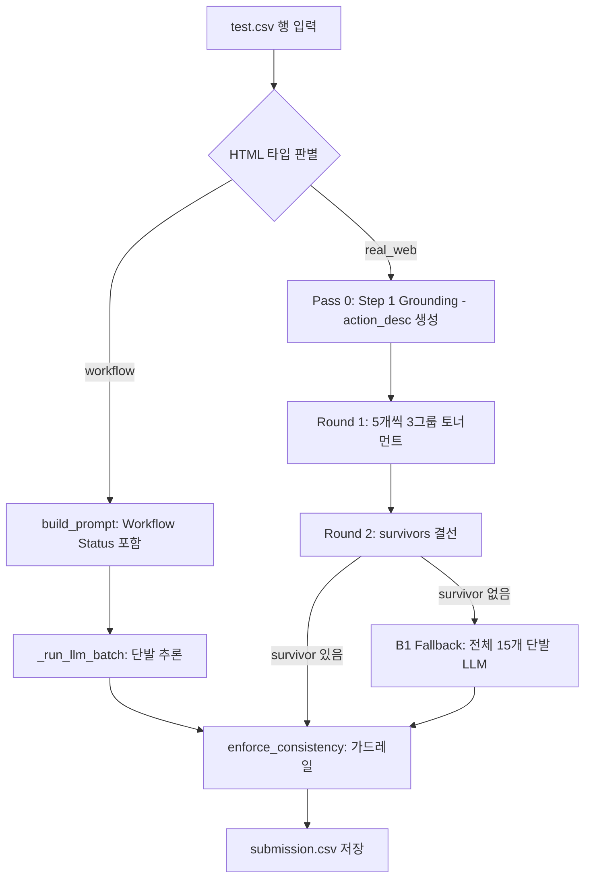

# 파이프라인 종합 설명서 (Unified Pipeline Documentation)
> 최종 업데이트: 2026-05-12
> 기준 코드: `src/preprocess.py` · `src/retrieval.py` · `src/train.py` · `src/inference.py`

본 문서는 프로젝트의 전체 아키텍처, 단계별 상세 로직, 그리고 주요 설계 결정을 통합하여 관리합니다.

---

## 1. 개요 (High-Level Overview)

본 프로젝트는 웹 브라우저 환경에서 사용자의 자연어 지시(Task)와 과거 이력(History)을 바탕으로 최적의 행동(Action)을 예측하는 에이전트를 개발하는 것을 목표로 합니다.

| 입력 데이터 | 설명 | 예시 |
|:---|:---|:---|
| `task` | 수행해야 할 작업 | "Search for flights to Tokyo" |
| `history` | 이전 단계 수행 기록 | "Step 1: [input] 출발지 -> TYPE: Seoul" |
| `cleaned_html` | 현재 화면의 HTML 소스 | `
...` |
| `candidates` | 클릭/입력 가능한 후보 15개 | `[{tag:"button", text:"Search"}, ...]` |

**최종 출력:** `(op, target_id, value)`
- `op`: CLICK, TYPE, SELECT 중 하나
- `target_id`: 15개 후보 중 선택된 요소의 ID
- `value`: TYPE/SELECT 시 입력/선택할 값

---

## 2. 전체 흐름도 (Architecture Flow)

현재 시스템은 HTML 타입에 따라 **Workflow**와 **Real Web** 두 가지 경로로 나뉩니다.

---

## 3. 핵심 모듈별 상세 설명

### 3.1. 전처리 및 규칙 엔진 (`src/preprocess.py`)
LLM 추론 전후의 데이터 정제 및 가드레일을 담당합니다.

*   **HTML 컨텍스트 추출 (`get_html_context`)**: 요소 주변의 `label`, `parent`, `children`, `near`(이웃 형제) 텍스트를 추출하여 Dual-View 관점의 정보를 제공합니다.
*   **후보 포맷팅 (`format_numbered_candidates`)**: 1~15번 번호를 부여하고, AgentOccam 기반의 속성 필터링(class, style 제거 등)을 적용합니다.
*   **히스토리 압축 (`_compress_history`)**: `[tag]text→OP` 형식으로 압축하여 토큰 소모를 60-70% 절감합니다.
*   **Consistency Guard (`enforce_consistency`)**: 모델이 잘못된 태그에 TYPE을 하거나 SELECT 옵션에 없는 값을 내뱉을 경우 규칙 기반으로 강제 수리합니다.

### 3.2. 검색기 (`src/retrieval.py`)
훈련 데이터에서 유사한 성공 사례를 찾아 Few-shot 예시로 제공합니다 (현재 `USE_RETRIEVAL = False`).
*   **우선순위**: (site, sig, type) → (site, type) → (sig, type) 순으로 검색.
*   **유사도**: Task 단어 집합의 Jaccard 유사도 사용.

### 3.3. 학습 모델 (`src/train.py`)
*   **모델**: `Qwen3-8B` (unsloth 4bit 양자화) + LoRA (r=16, alpha=32).
*   **데이터 증강**: `hard_negative_shuffle`을 통해 정답과 태그가 같은 요소를 바로 앞에 배치하여 변별력 강화.
*   **Grounding 학습**: real_web을 위해 `action_desc`를 먼저 생성하는 Step 1 Grounding 데이터 포함.

### 3.4. 추론 엔진 (`src/inference.py`)
*   **Qwen3 Thinking Mode**: `<think>` 태그를 사용하여 모델의 추론 과정을 유도하고 최종 JSON만 파싱합니다.
*   **토너먼트 방식**: 15개를 한 번에 보는 대신 5개씩 나누어 평가하여 `Target Acc` 병목을 해결합니다.
*   **앙상블**: `--ensemble` 플래그 사용 시 3-Fold 모델의 다수결 투표를 진행합니다.

---

## 4. HTML 타입별 전략

| 타입 | 판별 조건 | 주요 전략 |
|:---|:---|:---|
| **workflow** | `workflow-context` 포함 | 단계 정보(Step N of M)와 완료 필드 주입, 단발 추론 |
| **real_web** | 그 외 일반 웹 | 2단계 Grounding + 3그룹 토너먼트 추론 |

---

## 5. 성능 현황 (2026-05-10 기준)

*   **Exact Match (Public)**: 0.7516
*   **Target Acc**: 0.7825 (핵심 병목)
*   **Op Acc**: 0.9728
*   **Value Acc**: 0.9627
*   **workflow Exact**: 1.000 / **real_web Exact**: 0.356
