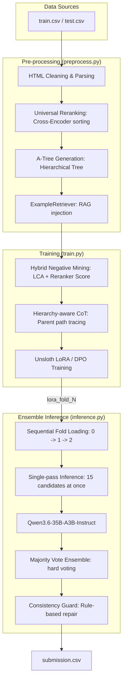

# Project Pipeline & Data Flow (Version 0513)

This document visualizes the current optimized pipeline, reflecting the transition to **Qwen3.6-35B-A3B (MoE)**, **Universal Reranking**, and **3-Fold Ensemble Inference**.

## 1. Overall System Architecture

---

## 2. Component Detail & Data Formats

### A. Pre-processing Phase (`preprocess.py`)
Transforms raw HTML and candidate lists into a structured, prioritized representation.

*   **Universal Reranking:** All 15 candidates are sorted by relevance using a Cross-Encoder (`rerank_candidates_by_embedding`) to focus LLM attention on top items.
*   **Hierarchical A-Tree:** Generates an indented tree structure that preserves DOM context while being token-efficient.
*   **RAG Integration:** Similarity-based retrieval of past successful actions, injected as "Similar Past Examples" at the top of the prompt.

### B. Training Phase (`train.py`)
Uses an enhanced **WEPO+** framework with high-capacity models.

*   **Model:** `Qwen3.6-35B-A3B-Instruct` (MoE) trained on A100 (40GB) using 4-bit LoRA.
*   **Hybrid DPO Sampling:**
    1.  **Chosen:** Correct action + Hierarchy-aware CoT (tracing 조상 경로).
    2.  **Rejected:** "Most plausible" mistake chosen by combining DOM distance (LCA) and Reranker scores.
*   **1-Epoch Strategy:** Prevents overfitting to specific element IDs/positions by seeing each unique augmented sample once.

### C. Inference Phase (`inference.py`)
Simplified, high-speed ensemble logic replaces the deprecated tournament system.

1.  **Single-pass Inference:** 35B model processes all 15 candidates in a single turn, leveraging its high intelligence for direct grounding.
2.  **3-Fold Ensemble:**
    *   Sequential loading/unloading of each fold model to maximize VRAM efficiency.
    *   **Majority Vote:** Predictions for `op`, `target_id`, and `value` are combined using hard voting.
3.  **Consistency Guard:**
    *   Ensures `op` matches element `tag` (e.g., SELECT for `<select>`).
    *   Validates `target_id` exists and clears `value` for CLICK operations.

---

## 3. Data Transformation Summary

| Stage | Format In | Format Out | Key Transformation |
| :--- | :--- | :--- | :--- |
| **Parsing** | Raw HTML String | BeautifulSoup Object | Universal DOM reconstruction |
| **Rerank** | Candidate List | Sorted List (15) | Cross-Encoder relevance sorting |
| **A-Tree** | BS4 Object | Indented MD Tree | Hierarchy pruning & ID mapping |
| **DPO Mining** | Prompt String | (Chosen, Rejected) Pair | Hybrid structural-semantic negative selection |
| **Inference** | Test Row | Single JSON Response | Fold-specific single-pass prediction |
| **Ensemble** | 3 x JSON | Final Action JSON | Majority voting & VRAM cleanup |
| **Guard** | Raw JSON | Repaired JSON | Tag-Op consistency enforcement |
