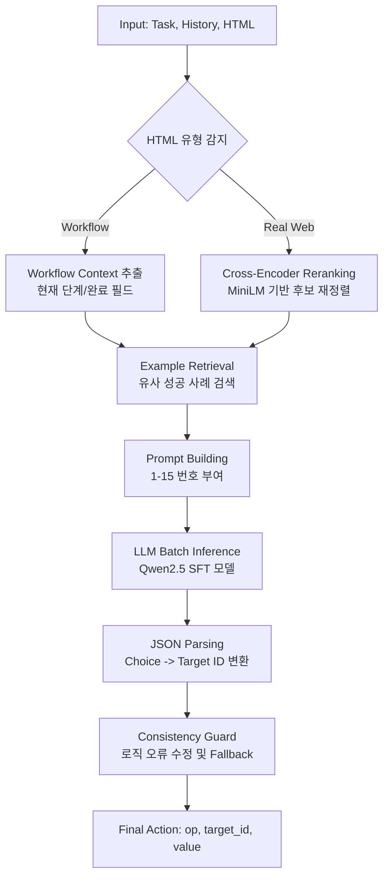

# Web UI Action Prediction Pipeline (Version 0508)
> **최종 업데이트:** 2026-05-08 기준
> **주요 특징:** SFT 기반 학습, 임베딩 재정렬(Reranking), RAG 활용 하이브리드 파이프라인

이 문서는 2026년 5월 8일 백업된 코드(`my_code_20260508`)를 분석하여 당시 시스템의 아키텍처와 추론 흐름을 설명합니다.

---

## 1. 전체 추론 흐름 (Overall Flow)

당시 시스템은 사용자의 `Task`와 `History`를 입력받아, HTML 유형을 먼저 분류한 뒤 각 유형에 최적화된 방식으로 후보(Candidates)를 가공하여 LLM에 전달하는 구조였습니다.

---

## 2. 주요 단계별 상세 분석

### Phase 1: 데이터 분류 및 전처리 (`preprocess.py`)
*   **유형 분류 (`detect_html_type`)**: HTML 내의 특정 클래스나 텍스트를 보고 '정형화된 폼(Workflow)'과 '복잡한 일반 웹(Real Web)'을 구분합니다.
*   **Workflow 특화 로직**: `extract_workflow_context`를 통해 현재 몇 번째 단계인지, 이전에 어떤 필드들을 채웠는지 정보를 추출하여 LLM이 중복 작업을 하지 않도록 돕습니다.
*   **Value 추출 (`extract_value_from_task`)**: 정규표현식과 퍼지 매칭(Fuzzy Match)을 조합하여 Task 문장에서 `TYPE`이나 `SELECT`에 필요한 값을 추출합니다.

### Phase 2: 후보 재정렬 및 검색 (`retrieval.py`)
*   **임베딩 기반 재정렬 (`rerank_candidates_by_embedding`)**: `Real Web` 환경에서는 15개의 후보 중 정답이 뒤에 있을 경우 LLM의 성능이 떨어지는 문제를 해결하기 위해, Cross-Encoder 모델을 사용하여 Task와 관련성이 높은 요소를 앞순서(1~5번)로 배치합니다.
*   **RAG (Retrieval-Augmented Generation)**: `ExampleRetriever`를 통해 과거의 유사한 작업 사례를 프롬프트에 주입하여 모델의 추론 정확도를 높입니다.

### Phase 3: 학습 및 데이터 증강 (`train.py`)
*   **SFT 학습**: DPO 이전 단계로, `trl.SFTTrainer`를 사용하여 `<think>` 태그 내의 사고 과정(CoT)과 최종 JSON 결과를 한 번에 학습시키는 방식입니다.
*   **셔플 증강 (`SHUFFLE_AUGMENT_N = 2`)**: 모델이 특정 번호에 편향되지 않도록 후보의 순서를 무작위로 섞은 데이터를 원본 대비 3배(원본 1 + 셔플 2) 생성하여 학습에 활용했습니다.

### Phase 4: 후처리 및 안전장치 (`inference.py`)
*   **배치 추론 (`_run_llm_batch`)**: GPU 효율을 위해 여러 행을 묶어 한 번에 추론합니다. (A100 기준 32개씩 처리)
*   **일관성 가드레일 (`enforce_consistency`)**: 
    *   LLM이 존재하지 않는 `target_id`를 생성하면 규칙 기반(Rule-based) 엔진으로 즉시 교체합니다.
    *   `CLICK` 액션인데 값이 들어있거나, `SELECT` 액션인데 옵션에 없는 값을 선택한 경우 자동으로 정정합니다.

---

## 3. 요약 (Conclusion)
0508 버전은 **"LLM에게 최적의 정보를 정렬해서 준다"**는 전략에 집중했습니다. 특히 **Cross-Encoder 랭킹**과 **Workflow 컨텍스트 주입**은 이 시기의 핵심적인 성능 향상 포인트였습니다. 현재의 DPO 기반 시스템은 이 0508 버전의 강력한 전처리 및 후처리 기반 위에 구축되었습니다.
