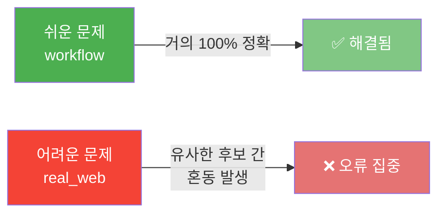
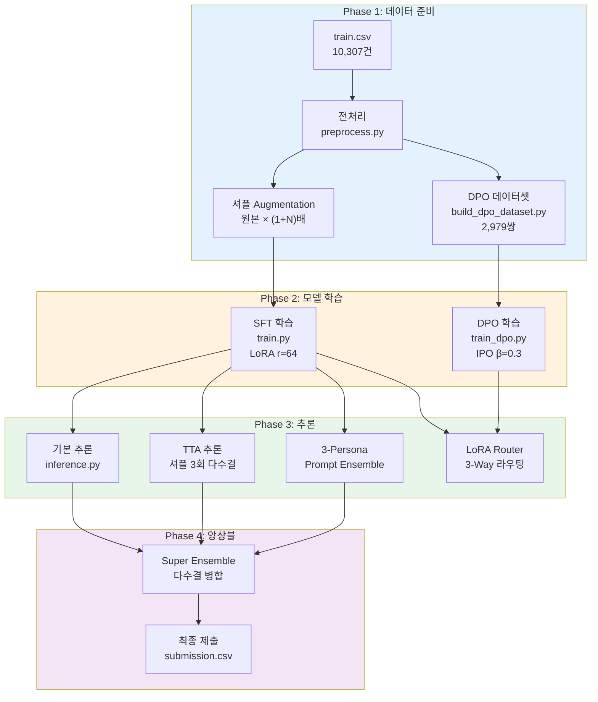
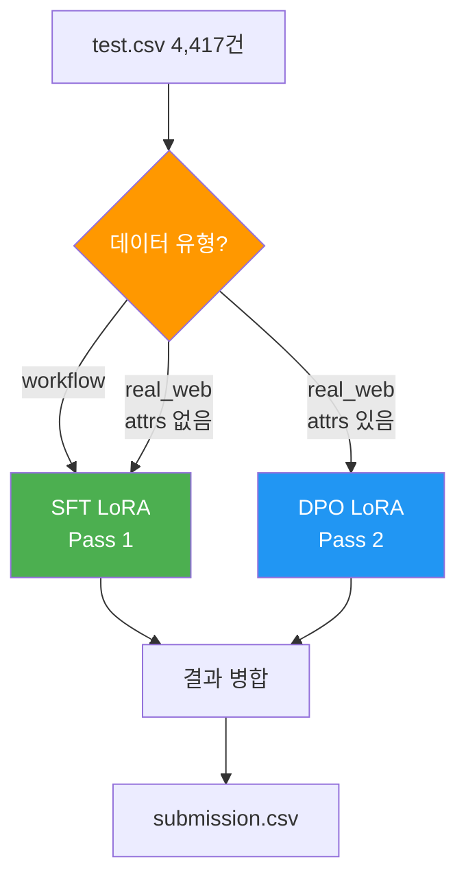
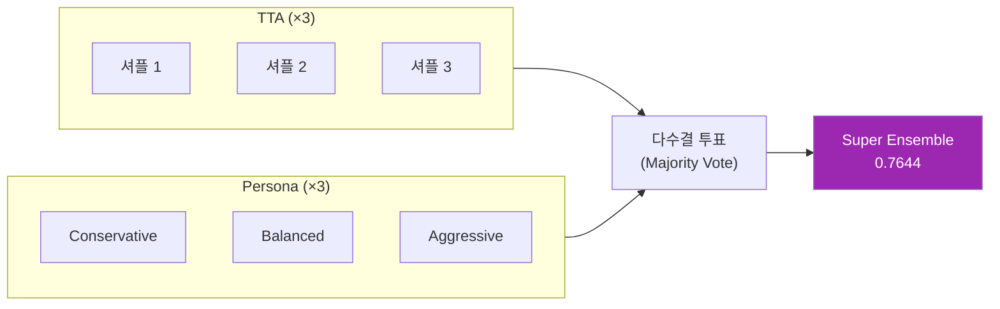
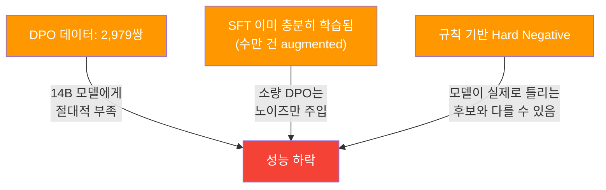
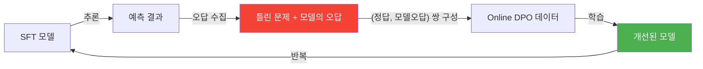

# 🌐 Web Agent Action Prediction — 프로젝트 회고록

> **대회:** Web Agent Action Prediction (Kaggle-style)  
> **기간:** 2026년 5월  
> **최종 점수:** Exact Match = **0.7644**  
> **팀 구성원:** HyunJin

---

## 1. 프로젝트 개요

### 1.1 과제 정의

사용자의 자연어 목표(예: *"장바구니에 다크블루 셔츠 추가"*)와 웹 페이지의 HTML DOM 후보 요소(최대 15개)가 주어졌을 때, **정답 웹 액션을 예측**하는 문제입니다.

| 항목 | 내용 |
|---|---|
| **입력** | 자연어 Task + 최대 15개 HTML 후보 요소 (tag, text, attrs) |
| **출력** | `{"op": "CLICK\|TYPE\|SELECT", "choice": <1~15>, "value": "..."}` |
| **평가 지표** | **Exact Match** — op, target_id, value 세 가지가 **모두** 일치해야 정답 |
| **데이터 유형** | `workflow` (구조화된 폼) + `real_web` (실제 웹사이트) |
| **학습 데이터** | 10,307건 (workflow 5,155 + real_web 5,152) |
| **테스트 데이터** | 4,417건 |

### 1.2 핵심 난이도



- **workflow:** 구조화된 폼 → 버튼 텍스트가 명확 → 모델이 쉽게 구분
- **real_web:** 실제 웹사이트 → 같은 `<div>` 태그에 비슷한 텍스트 → distractor와 정답 혼동

---

## 2. 시스템 아키텍처

### 2.1 전체 파이프라인



### 2.2 베이스 모델 (SFT)

| 항목 | 설정 |
|---|---|
| 베이스 모델 | `Qwen/Qwen2.5-Coder-14B-Instruct` |
| 파인튜닝 | LoRA (r=64, alpha=128, dropout=0) |
| 프레임워크 | Unsloth + TRL SFTTrainer |
| 양자화 | 4-bit (bnb) |
| 시퀀스 길이 | 2048 |
| 학습 스텝 | 2,400 steps |
| 데이터 증강 | 후보 순서 셔플 (real_web은 4배, workflow는 2배) |

### 2.3 추론 전략 비교

| 전략 | 방식 | 추론 횟수 | 핵심 아이디어 |
|---|---|---|---|
| **기본 추론** | 1회 추론 | ×1 | 단순 예측 |
| **TTA** | 후보 순서 3회 셔플 → 다수결 | ×3 | 위치 편향 제거 |
| **3-Persona** | Conservative/Balanced/Aggressive 프롬프트 | ×3 | 관점 다양화 |
| **Super Ensemble** | TTA + Persona 결과 합산 다수결 | ×6+ | 최대 안정성 |

### 2.4 3-Way LoRA Router 아키텍처

DPO 실험을 위해 설계한 동적 라우팅 시스템입니다.



> [!NOTE]
> attrs가 없는 real_web을 DPO에서 제외한 이유: `<div>`, `<div>` 처럼 구분이 불가능한 빈 껍데기 태그로 DPO 학습 시, 모델이 "위치(Position)"만으로 판단하는 편향을 학습하게 됩니다.

---

## 3. 실험 과정

### 3.1 SFT 베이스라인 구축 ✅

**결과: Exact Match ≈ 0.76**

SFT 단계에서 이미 매우 높은 성능을 달성했습니다. 핵심 기여 요인:

1. **임베딩 기반 후보 재정렬** (`rerank_candidates_by_embedding`): real_web 데이터에서 task와 가장 관련 높은 후보를 앞쪽에 배치
2. **셔플 Augmentation**: 위치 편향을 제거하여 real_web 성능 향상
3. **규칙 기반 후처리** (`enforce_consistency`, `fallback_rule_based`): 모델 출력의 일관성 보장

---

### 3.2 앙상블 전략 ✅

**결과: Exact Match = 0.7644 (최종 최고점)**



**앙상블 분석 결과:**
- 기존 좋은 submission 4개(sub7, prompt_ens, tta, super_ens_v2) 간 다수결 분석
- **3표 이상으로 super_ens_v2와 다른 행 = 0건**
- → 이미 최적의 합의 상태에 도달함

---

### 3.3 DPO 1차 시도 — Contrastive Reasoning ❌

**결과: Exact Match = 0.6455 (-12% 하락)**

#### 가설
> SFT는 "정답이 3번이다"만 학습한다. DPO로 "3번이 7번보다 낫다"는 상대적 선호를 추가 학습하면 distractor 구분 능력이 향상될 것이다.

#### 구현

```python
# Contrastive Reasoning: chosen과 rejected에 서로 다른 reasoning 부여
chosen_reasoning = "Element 3 is correct. Element 7 is a distractor."
rejected_reasoning = "Element 7 is not correct. The target is Element 3."
```

#### 실패 원인: Reward Hacking

모델이 HTML 후보를 분석하는 능력을 키운 것이 아니라, **"distractor라는 단어를 출력하면 점수가 올라간다"는 꼼수를 발견**해버렸습니다.

**학습 로그 (위험 신호):**

| Step | Loss | Margin | Accuracy | 해석 |
|------|------|--------|----------|------|
| 20 | 0.4153 | 1.687 | 72.5% | 정상 학습 |
| 40 | **0.00009** | **17.86** | **100%** | 🚨 꼼수 발견! |
| 60 | 0.000000006 | 22.0 | 100% | 극단적 과적합 |
| 187 | **0.000000002** | **25.01** | 100% | 완전한 과적합 |

> [!CAUTION]
> Loss가 0에 수렴하고 Margin이 25까지 폭발하는 것은 모델이 **정답/오답의 "내용"이 아닌 "텍스트 패턴"**을 학습했다는 결정적 증거입니다. 이를 Reward Hacking이라 합니다.

---

### 3.4 DPO 2차 시도 — IPO + 과적합 방지 ❌

**결과: Exact Match ≈ 0.65 (여전히 하락)**

#### 수정 사항

**1. 데이터 수정: 동일 Reasoning 강제**

```python
# 수정 전 (Reward Hacking 유발)
chosen_r  = "Element 3 is correct. Element 7 is a distractor."
rejected_r = "Element 7 is not correct. The target is Element 3."

# 수정 후 (choice 번호만 다르게)
reasoning = "The task requires a click action. Element 3 (button: 'Buy') matches the target."
chosen   = reasoning + '{"op": "CLICK", "choice": 3, "value": ""}'
rejected = reasoning + '{"op": "CLICK", "choice": 7, "value": ""}'  # 번호만 다름!
```

**2. SOTA 과적합 방지 기법 적용**

| 설정 | 1차 (실패) | 2차 (수정) | 효과 |
|------|-----------|-----------|------|
| `loss_type` | `"sigmoid"` | **`"ipo"`** | DPO의 log-sigmoid 과적합을 수학적으로 차단 |
| `beta` | 0.1 | **0.3** | SFT로부터 과도한 이탈 방지 (KL 고삐 강화) |
| `label_smoothing` | 0.0 | **0.1** | "정답 = 90% 확률"로 부드럽게 → 과신 방지 |

**2차 학습 로그 (건강한 수렴 확인):**

| Step | Loss | Margin | Accuracy | 해석 |
|------|------|--------|----------|------|
| 10 | 2.568 | 0.020 | 71.9% | 학습 시작 |
| 20 | 0.467 | 0.343 | 100% | 빠른 수렴 |
| 100 | 0.006 | 0.499 | 100% | **안정적 수렴** |
| 187 | **0.006** | **0.498** | 100% | ✅ 바닥에서 안정화 |

> [!TIP]
> IPO + label_smoothing 덕분에 Loss가 0.006에서 더 이상 내려가지 않고 안정화되었습니다. 1차의 0.000000002와 극적인 차이입니다. **과적합 방지 기법 자체는 성공**했습니다.

#### 그럼에도 실패한 이유: 근본적 한계



1. **데이터 양 부족:** 2,979쌍 vs SFT의 수만 건 augmented 데이터
2. **SFT 성능 포화:** 이미 잘 학습된 모델에 소량 DPO는 잡음으로 작용
3. **Hard Negative 품질:** 규칙 기반 선정 ≠ 모델이 실제로 혼동하는 후보

---

## 4. 핵심 교훈 (Lessons Learned)

### 교훈 1: DPO는 데이터의 "양 × 품질" 임계점이 존재한다

> DPO는 SFT와 달리, 정답/오답 쌍의 품질이 학습 효과를 결정합니다. 2,979쌍은 14B 파라미터 모델이 유의미한 선호도를 학습하기에 **절대적으로 부족**했습니다.

### 교훈 2: Contrastive Reasoning은 Reward Hacking의 온상

> Chosen/Rejected에 서로 다른 텍스트를 넣으면, 모델은 **"내용"이 아닌 "텍스트 패턴"**을 지름길(shortcut)로 학습합니다. DPO의 chosen/rejected는 반드시 **최소한의 차이만** 가져야 합니다.

### 교훈 3: 잘 학습된 SFT 위에 소량 DPO는 독이 된다

> SFT가 이미 0.76 수준의 성능을 보이고 있을 때, 충분하지 않은 DPO 데이터는 기존 능력을 훼손할 뿐 새로운 능력을 부여하지 못합니다.

### 교훈 4: IPO + Label Smoothing은 과적합 방지에 효과적

> Loss가 0.000000002로 급락하던 문제를 0.006에서 안정화시켰습니다. **기법 자체는 유효**하며, 충분한 데이터가 있었다면 성능 향상으로 이어졌을 가능성이 있습니다.

### 교훈 5: 앙상블이 단일 모델 개선보다 안정적

> TTA + 3-Persona Prompt Ensemble의 조합은 단일 모델 성능 개선 시도(DPO)보다 **리스크 없이 안정적인 점수 향상**을 제공했습니다.

### 교훈 6: 마감 전에는 검증된 방법이 최선

> 새로운 기법(DPO, DOM Context Injection 등)은 충분한 실험 시간이 확보되었을 때만 시도해야 합니다. 시간 제약 하에서는 기존 최고 점수를 유지하는 것이 합리적 선택입니다.

---

## 5. 향후 개선 방향

### 5.1 Online DPO (Self-Play)



- 규칙 기반 Hard Negative 대신 **모델이 실제로 틀린 답**을 rejected로 사용
- 이 방식은 모델의 **진짜 약점**을 정확히 공략 가능

### 5.2 DPO 데이터 대규모 증강

| 기법 | 현재 | 목표 | 예상 쌍 수 |
|------|------|------|-----------|
| 셔플 Augment | 없음 | 4회 셔플 | ×4 |
| Top-K Hard Neg | Top-1 | Top-3 | ×3 |
| **합계** | 2,979 | — | **~36,000** |

### 5.3 DOM Context Injection (데이터 강화)

attrs가 비어있는 빈 껍데기 태그에 부모/자식 노드의 텍스트를 주입하는 방식.

```
수정 전: <div> (text="", attrs="")         → 구분 불가
수정 후: <div> (text="", attrs="child_text='나이키 운동화 99,000원'") → 구분 가능!
```

> [!WARNING]
> `candidate_id` → HTML DOM 노드 매핑의 정확성이 검증되지 않으면 **할루시네이션(거짓 정보 주입)**이 발생하여 오히려 성능이 하락합니다. 반드시 사전 검증 필요.

### 5.4 더 큰 모델

- **DeepSeek-R1-32B + 4bit 양자화** → A100 80GB에 적재 가능
- 더 큰 모델은 few-shot 능력이 강력하여 DPO 없이도 real_web 성능 향상 기대

---

## 부록: 프로젝트 파일 구조

```
my_code_0514from0508/
├── preprocess.py                  # 프롬프트 빌더, HTML 파서, 유틸리티
├── retrieval.py                   # Few-shot 예제 검색기 (임베딩 기반)
├── train.py                       # SFT 학습 (LoRA + OOF 지원)
├── build_dpo_dataset.py           # DPO 데이터셋 생성 (Hard Negative Mining)
├── train_dpo.py                   # DPO 학습 (IPO + β=0.3 + label_smoothing)
├── inference.py                   # 기본 추론
├── inference_tta.py               # TTA 추론 (후보 셔플 다수결)
├── inference_prompt_ensemble.py   # 3-Persona 앙상블 추론
├── inference_lora_router.py       # 3-Way LoRA 라우팅 추론
├── inference_dpo_merge.py         # DPO-only 추론 + 기존 submission 병합
├── lora_model/                    # SFT LoRA 가중치
└── lora_model_dpo/                # DPO LoRA 가중치
```

## 부록: 메트릭 이력

| # | 제출 파일 | Exact Match | op Acc | target Acc | value Acc | 방법 |
|---|-----------|-------------|--------|------------|-----------|------|
| 1 | submission (7).csv | ~0.76 | 0.95 | 0.80 | 0.94 | SFT 단독 |
| 2 | submission_tta.csv | ~0.76 | 0.95 | 0.80 | 0.94 | + TTA |
| 3 | submission_prompt_ensemble.csv | ~0.76 | 0.95 | 0.80 | 0.94 | + 3-Persona |
| 4 | **submission_super_ensemble_v2.csv** | **0.7644** | — | — | — | **최종 최고점** |
| 5 | submission_lora_router.csv | 0.6455 | 0.94 | 0.68 | 0.94 | DPO 1차 ❌ |
| 6 | submission_dpo_merged.csv | ~0.65 | — | — | — | DPO 2차 IPO ❌ |

---

> **최종 결론:** SFT + 앙상블(TTA + Prompt Ensemble)이 이 대회에서 가장 안정적이고 효과적인 전략이었습니다. DPO는 데이터 규모의 한계로 효과를 발휘하지 못했으나, IPO/label_smoothing 등 과적합 방지 기법의 유효성은 학습 로그를 통해 확인되었습니다.
