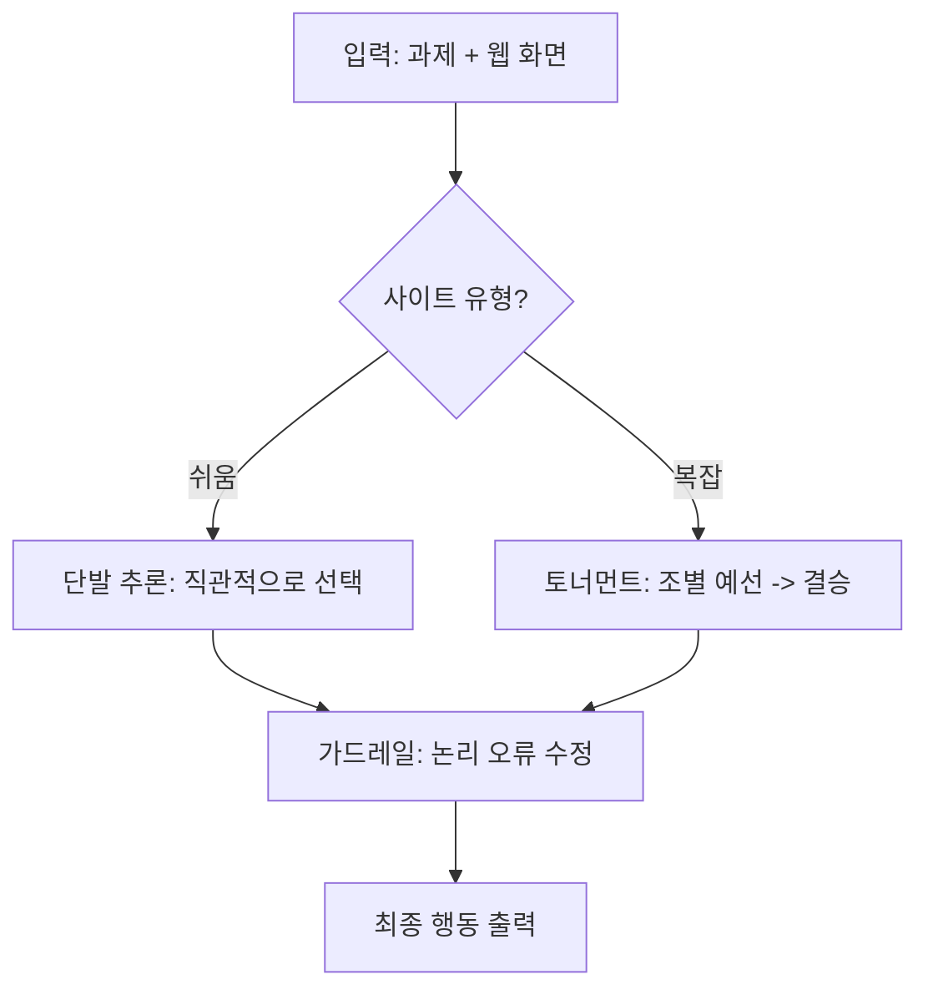

# Inference Strategy: Tournament vs. Workflow

웹 UI 에이전트가 어떻게 "최적의 클릭 지점"을 찾는지 중학생도 이해할 수 있게 설명합니다.

## 1. 두 가지 추론 방식 (Workflow vs. Real Web)

우리 시스템은 웹사이트의 종류에 따라 두 가지 전략을 사용합니다.

### 🏢 방식 A: 워크플로우 (Workflow) - "베테랑의 직관"
*   **대상:** 구조가 정해진 일반적인 업무 사이트.
*   **설명:** 15명의 후보 중 정답이 누구인지 한 번에 투표합니다.
*   **효과:** 빠릅니다. 이미 가본 길이라 고민할 필요가 없습니다.

### 🌐 방식 B: 토너먼트 (Tournament) - "끝장 승부"
*   **대상:** 복잡하고 낯선 실제 웹사이트 (`real_web`).
*   **설명:** 15명의 후보를 한 번에 비교하면 모델이 헷갈려 합니다. 그래서 **5명씩 3개 조**로 나누어 예선전을 치르고, 각 조의 1등끼리 결승전을 치릅니다.
*   **시각화:**
    ```text
    [예선 1조: 5명] ──> 1등 선발 ┐
                                │
    [예선 2조: 5명] ──> 1등 선발 ┼─> [결승전: 3명] ──> 최종 정답!
                                │
    [예선 3조: 5명] ──> 1등 선발 ┘
    ```
*   **효과:** 정확도가 매우 높습니다. 좁은 범위에서 꼼꼼히 비교하기 때문입니다.

---

## 2. 왜 이렇게 하나요? (효과 설명)

1.  **모델의 집중력 향상:** LLM은 한 번에 너무 많은 정보를 주면 중요한 걸 놓칩니다. 정보를 쪼개서 주면 훨씬 똑똑하게 판단합니다.
2.  **생각하고 말하기 (Thinking):** 모델이 바로 정답을 말하지 않고 `<think>` 태그 안에서 "왜 이게 정답일까?"라고 스스로 추론 과정을 거칩니다. 마치 수학 문제를 풀 때 풀이 과정을 적는 것과 같습니다.
3.  **가드레일 (Consistency Guard):** 모델이 실수로 "클릭인데 글자를 입력해라" 같은 이상한 명령을 내리면, 시스템이 자동으로 이를 바로잡아줍니다.

## 3. 요약 그래프



이 방식은 **"빠르게 갈 곳은 빠르게, 신중할 곳은 신중하게"** 판단하여 속도와 정확도의 균형을 맞추는 최첨단 전략입니다.
